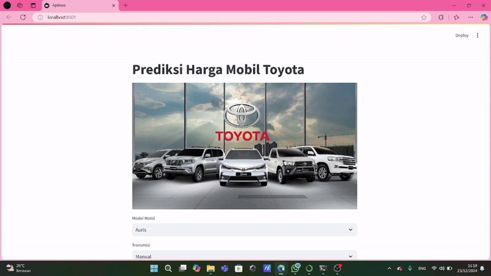

# Prediksi Harga Mobil Bekas Toyota

MIT License | Python 3.8+ | Streamlit | Scikit-learn

Aplikasi interaktif untuk memprediksi harga mobil bekas berdasarkan data spesifik pengguna. Dibangun menggunakan Streamlit untuk antarmuka pengguna yang intuitif.

---

## Demo Prediksi Harga Mobil Bekas Toyota 



✨ **Fitur Utama**

🧠 **Machine Learning yang Akurat**

- Algoritma prediksi harga berbasis data.
- Evaluasi performa menggunakan MAE dan MAPE.

🌐 **Antarmuka Pengguna Modern**

- Desain responsif.
- Antarmuka berbasis web yang mudah digunakan.

---

## 🚀 Quickstart

### Prasyarat

Pastikan Anda telah menginstal:

- Python 3.8 atau lebih tinggi
- `pip` untuk mengelola pustaka Python

```bash
# Periksa versi Python
python --version
```

### Instalasi

1. Clone repositori:

   ```bash
   git clone https://github.com/Hafizhayyasypratama04/Prediksi-Harga-Mobil-Bekas-Toyota.git
   cd Prediksi-Harga-Mobil-Bekas-Toyota
   ```

2. Setup environment:

   ```bash
   python -m venv venv
   source venv/bin/activate  # Linux/Mac
   # atau
   venv\Scripts\activate  # Windows
   ```

3. Install dependensi:

   ```bash
   pip install -r requirements.txt
   ```

4. Jalankan aplikasi:

   ```bash
   streamlit run app.py
   ```

5. Buka browser dan akses `http://localhost:8501`.

---

## 🛠️ Teknologi yang Digunakan

- **Streamlit**: Framework untuk aplikasi web interaktif.
- **Scikit-learn**: Model machine learning.
- **Pandas**: Manipulasi data.
- **NumPy**: Komputasi numerik.

---

## 🤝 Kontribusi

- **Hafizh Ayyasy Pratama** 
- **Naufal Aulia Rachman**
- **Sadira Zahra Aydin**

---

⭐️ Star repository ini jika membantu proyek Anda!

